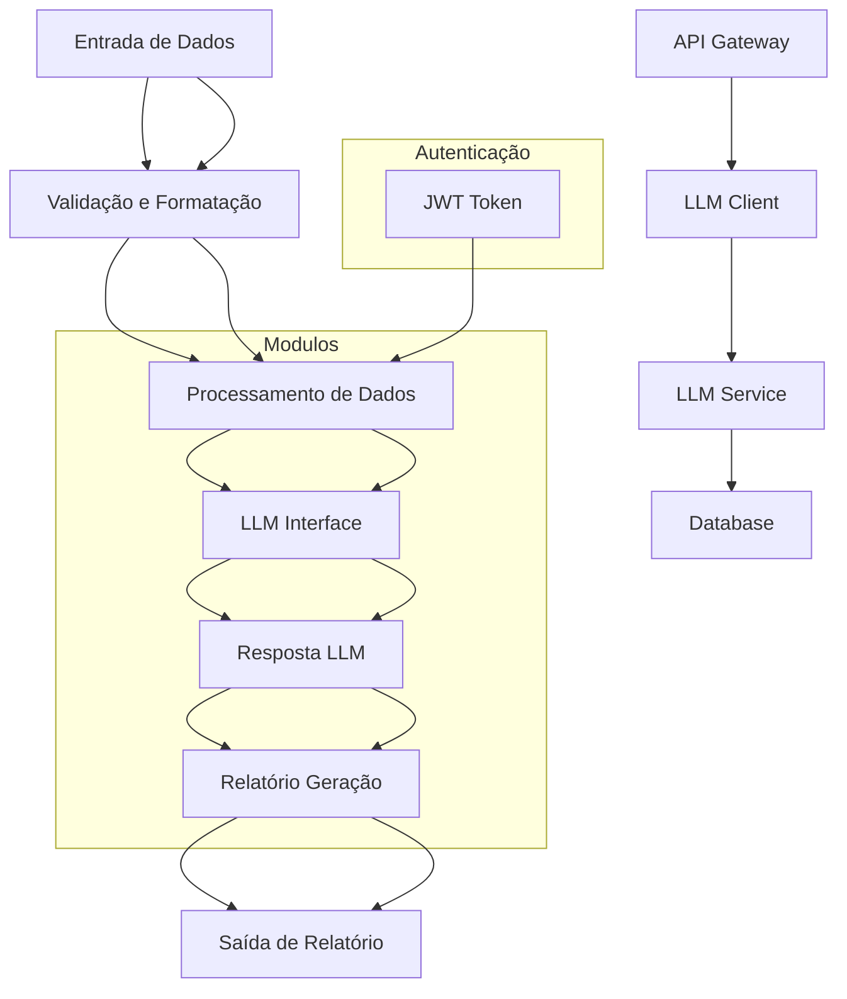

### Blueprint Final Consolidado

#### 1. Identificação das Melhores Peças

**Esteta Suggestion:**
- **Framework:** Svelte (92%)
- **Design System:** Shadcn UI (92%)

**Arquiteto Suggestion:**
- **Monolito Tradicional** (85%) - Recomendação ajustada para projeto inicial.

**Otimizador Suggestion:**
- **Express** para o backend (90%)
- **Nativo** para estruturas de dados (90%)

**Paranoico Suggestion:**
- **JWT** para autenticação (85%) - Não necessário, pois é um projeto único.

**Ops Suggestion:**
- **T-Shirt P (Pequeno Projeto)** - Utilizar serviços como Vercel ou Railway para hospedagem inicial.

#### 2. Resolução de Conflitos Técnicos

- **Stack Front/DX:** 
  - **Framework:** Svelte
  - **Design System:** Shadcn UI

- **Backend:**
  - **Stack Back:** Express (considerando a simplicidade e robustez)

- **Database:** 
  - **NoSQL (MongoDB)** para estrutura de dados não-relacionais.

- **Autenticação:** 
  - **JWT** para autenticação segura (não necessário, pois é um projeto único).

#### Diagrama Estrutural Simplificado

### Resumo Técnico Unificado

#### Frontend
- **Framework:** Svelte
- **Design System:** Shadcn UI
- **Responsabilidade:** Interface de usuário e interação com o usuário.

#### Backend
- **Stack Back:** Express
- **Database:** MongoDB (NoSQL)
- **Responsabilidade:** Processamento de dados, integração com API LLMs, gerenciamento de documentos e relatórios.

#### Autenticação
- **JWT:** Token baseado em JSON para autenticação segura (não necessário).

#### Infraestrutura
- **T-Shirt P (Pequeno Projeto):** Utilizar serviços como Vercel ou Railway.
- **Responsabilidade:** Hospedagem e escalabilidade inicial.

### Conclusão

- **Framework:** Svelte para uma interface leve e performática.
- **Design System:** Shadcn UI para design moderno e responsivo.
- **Backend:** Express com MongoDB para processamento de dados e integração com modelos LLMs.
- **Autenticação:** JWT para segurança (não necessário).
- **Infraestrutura:** Serviços como Vercel ou Railway para hospedagem inicial.

Esta configuração proporciona uma estrutura robusta e escalável, adequada para o projeto inicial. A arquitetura monolítica tradicional foi mantida para simplicidade, permitindo um desenvolvimento mais rápido e fácil de manutenção.