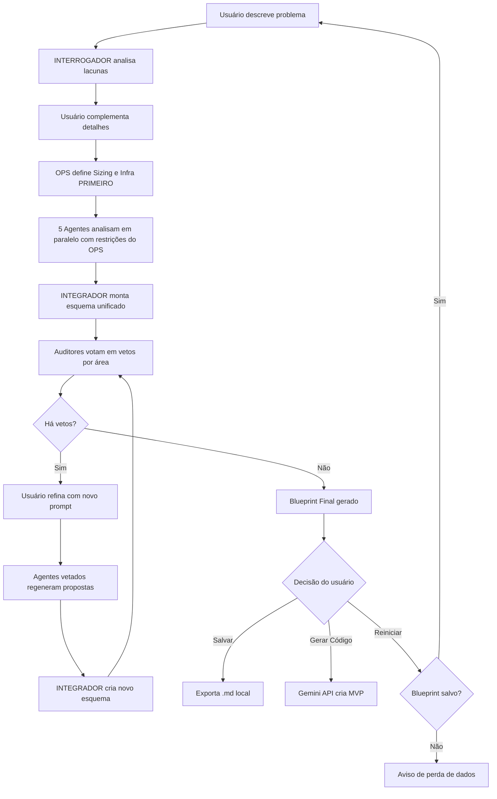

# TRIBUNAL // THOUGHT CABINET

> _"As vozes na sua cabeça começam a discutir..."_

Um sistema multi-agente de arquitetura de software com visuais inspirados em Disco Elysium. Simula um debate interno entre diferentes especializações técnicas para criar blueprints arquiteturais completos.

## Conceito

O **TRIBUNAL** transforma o processo de design de software em um diálogo interno entre personas especializadas:

- **INTERROGADOR** — Analista de Requisitos que identifica lacunas
- **ESTETA** — Head de Design & DX que define a experiência visual
- **ARQUITETO** — Tech Lead que estrutura a lógica do sistema
- **ARQUIVISTA** — DBA que modela a persistência de dados
- **OTIMIZADOR** — Engenheiro de Performance que analisa eficiência
- **OPS** — SRE que define infraestrutura e escalabilidade
- **PARANOICO** — Engenheiro de Segurança que blinda o sistema

Cada agente analisa o problema sob sua perspectiva, depois um **INTEGRADOR** unifica as ideias e auditores votam nas melhores soluções.

---

## Arquitetura

### Stack Principal

- **Interface:** ttkbootstrap (Tkinter temático)
- **LLM Local:** Ollama (qwen2.5:7b)
- **LLM Cloud:** Gemini 2.5 Flash (geração de código)
- **Persistência:** Arquivos Markdown locais

### Fluxo de Execução



---

## Instalação

### Pré-requisitos

1. **Python 3.8+**
2. **Ollama** instalado e rodando localmente
3. **API Key do Google Gemini** (opcional, para geração de código)

### Setup

```bash
# Clone o repositório
git clone https://github.com/AndersonFreitasF/tribunal.git
cd tribunal

# Instale as dependências
pip install ttkbootstrap requests python-dotenv google-generativeai

# Baixe o modelo Ollama
ollama pull qwen2.5:7b
# (Uso esse modelo porque é o que minha placa de vídeo suporta sem offloading.
#  Caso a sua tenha mais de 8GB VRAM, recomendo modelos maiores)
#  Ou caso seu bolso seja fundo, recomendo rodar em modelos maiores via nuvem, como é feito a chamada de gerar código

# Configure a API Key do Gemini (opcional)
echo "GEMINI_API_KEY=sua_chave_aqui" > .env

# Execute
python main.py
```

---

## Como Usar

### 1. Conceitualização

Descreva o sistema que deseja arquitetar de forma abstrata:

```
"Um sistema de agendamento para clínicas médicas com notificações automáticas"
```

### 2. Interrogatório

O INTERROGADOR faz perguntas críticas sobre:

- Escopo funcional (essencial vs nice-to-have)
- Regras de negócio não especificadas
- Restrições técnicas

Você responde e complementa os detalhes.

### 3. O Tribunal (Execução em Cascata)

**IMPORTANTE:** O fluxo foi otimizado para evitar overengineering:

#### Fase 1: OPS Define o Terreno
O agente **OPS** roda **sozinho primeiro** e define:
- **T-Shirt Sizing** (P/M/G)
- Infraestrutura base permitida
- Restrições de complexidade

Esta decisão é **soberana** e trava o contexto para os demais agentes.

#### Fase 2: Demais Agentes em Paralelo
Com as regras do OPS estabelecidas, os 5 agentes restantes trabalham simultaneamente **respeitando as restrições**:

- **ESTETA** sugere frameworks e design system (dentro do sizing)
- **ARQUITETO** propõe padrões e estrutura (sem microservices se P)
- **ARQUIVISTA** modela entidades e escolhe banco de dados
- **OTIMIZADOR** recomenda libs e otimizações (adequadas ao porte)
- **PARANOICO** analisa vetores de ataque

**Proteção Anti-Overengineering:**
- Se OPS define "Tamanho: P", o sistema **proíbe** Kubernetes e Microservices
- Cada agente recebe o contexto travado: _"Você DEVE respeitar o Sizing"_

#### Fase 3: Integração
O **INTEGRADOR** une as propostas em um esquema coerente.

### 4. Paranoia Crítica (Auditoria por Especialidade)

Cada agente audita o esquema montado **apenas na sua área de expertise**:

- **Protocolo de Não-Interferência:** O OPS não pode vetar cores (Esteta), o Esteta não pode vetar banco de dados (Arquivista)
- **Vetos Técnicos Apenas:** Opiniões subjetivas são proibidas
- **JSON de Veto:** `{"veto": "AGENTE_ALVO", "motivo": "...", "sugestao": "..."}`

#### Fluxo de Refinamento (Se houver vetos)

1. Sistema exibe os vetos encontrados
2. Você fornece uma ordem via campo **AUTHORITY** (ex: "Simplifique o banco mantendo PostgreSQL")
3. Sistema executa refinamento:
   - Agentes vetados regeneram suas propostas
   - INTEGRADOR cria novo esquema
   - Vetos são resetados
4. Você pode finalizar ou fazer nova rodada de auditoria

**Diferencial:** O refinamento é guiado pelo usuário, não automático.

### 5. A Solução

O blueprint final é gerado incluindo:

- Stack completa justificada (Seguro vs Melhor)
- Estrutura de pastas
- Diagrama Mermaid de fluxo
- Modelagem de dados
- Considerações de segurança e performance
- Trade-offs explícitos (Lei do Trade-off da Tech Bible)

**Opções finais:**

- `[SALVAR DIAGRAMA]` → Exporta para `output/blueprint_TIMESTAMP.md`
- `[GERAR CÓDIGO (NUVEM)]` → Envia para Gemini gerar MVP em `code_output/`
- `[VOLTAR AO INÍCIO]` → Reinicia o processo (com aviso se não salvou)

---

## Customização

### Tech Bible (`project_context.md`)

Configure a Tech Bible para suas próprias restrições de projeto.

**Configurações atuais:**

```markdown
- **Infra:** Proibido Kubernetes para projetos < Size M
- **Code:** Evite `any` (TS), Magic Strings, God Classes
- **Security:** Nunca hardcode credenciais
- **Trade-off Law:** Toda escolha deve citar custo oculto + ponto de falha
```

### Prompts dos Agentes

Edite `PROMPTS` em `main.py` para ajustar:
- Personalidades dos agentes
- Nível de detalhe técnico
- Estilos de linguagem visual (ESTETA)

### Temperatura da IA

```python
# Em main.py
call_ollama(..., temperature=0.5)  # Criatividade vs Determinismo
```

- **0.2-0.4:** Mais conservador (auditorias)
- **0.5-0.7:** Balanceado (geração de ideias)

---

## Estrutura de Arquivos

```
tribunal/
├── main.py                 # Aplicação principal
├── project_context.md      # Tech Bible (restrições globais)
├── .env                    # API keys (NÃO versionar)
├── output/                 # Blueprints salvos
│   └── blueprint_YYYYMMDD_HHMMSS.md
├── code_output/            # Código gerado pelo Gemini
│   └── code_mvp_YYYYMMDD_HHMMSS.md
└── README.md
```

---

## Diferenciais Técnicos

### 1. Execução em Cascata (OPS First)
Evita que agentes sugiram soluções incompatíveis com o sizing do projeto.

### 2. Auditoria Especializada
Vetos só são válidos se o auditor estiver dentro da sua área de expertise.

### 3. Refinamento Guiado
O usuário direciona as correções via campo AUTHORITY ao invés de loops automáticos.

### 4. Proteção contra Perda de Dados
Sistema avisa antes de reiniciar se o blueprint não foi salvo.

### 5. Tech Bible como Árbitro
Todas as decisões são validadas contra `project_context.md`.

---

## Troubleshooting

### Ollama não conecta
```bash
# Verifique se o serviço está rodando
ollama serve

# Teste a API
curl http://localhost:11434/api/generate -d '{"model":"qwen2.5:7b","prompt":"test"}'
```

### Agentes sugerem soluções incompatíveis
- Verifique se a Tech Bible está carregada corretamente
- Confirme que o OPS definiu o sizing explicitamente
- Revise as keywords de detecção de sizing no código (linha ~285)

---

## Roadmap (Caso eu resolva otimizar o projeto)

- [ ] Exportação para formato JSON estruturado
- [ ] Sistema de memória entre sessões (SQLite local)
- [ ] Suporte a modelos Anthropic Claude via API
- [ ] Interface web alternativa (FastAPI + HTMX)
---

## Contribuindo

Dúvidas ou sugestões? Abra uma issue no repositório!

---

_"O diagrama se forma na sua frente."_
