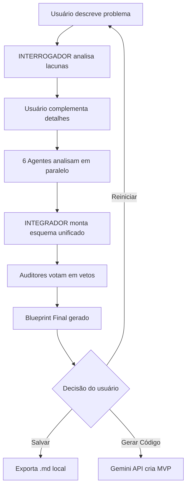

# TRIBUNAL // THOUGHT CABINET

> _"As vozes na sua cabeça começam a discutir..."_

Um sistema multi-agente de arquitetura de software com visuais inspirados em Disco Elysium. Simula um debate interno entre diferentes especializações técnicas para criar blueprints arquiteturais completos.

## **Nota 1:** Esse é um projeto sem fins de uso real que criei apenas porque tive essa ideia e resolve tentar implementa-la, por conta disso o codigo esta sujeito a não ser otimizado e os prompts e consumo de tokens não estarem refinados, mas foi bem divertido de codar isso

## Conceito

O **TRIBUNAL** transforma o processo de design de software em um diálogo interno entre personas especializadas:

- **INTERROGADOR** — Analista de Requisitos que identifica lacunas
- **ESTETA** — Head de Design & DX que define a experiência visual
- **ARQUITETO** — Tech Lead que estrutura a lógica do sistema
- **ARQUIVISTA** — DBA que modela a persistência de dados
- **OTIMIZADOR** — Engenheiro de Performance que analisa eficiência
- **OPS** — SRE que define infraestrutura e escalabilidade
- **PARANOICO** — Engenheiro de Segurança que blinda o sistema

Cada agente analisa o problema sob sua perspectiva, depois um **INTEGRADOR** unifica as ideias e auditores votam nas melhores soluções.

---

## Arquitetura

### Stack Principal

- **Interface:** ttkbootstrap (Tkinter temático)
- **LLM Local:** Ollama (qwen2.5:7b)
- **LLM Cloud:** Gemini 1.5 Flash (geração de código)
- **Persistência:** Arquivos Markdown locais

### Fluxo de Execução



---

## Instalação

### Pré-requisitos

1. **Python 3.8+**
2. **Ollama** instalado e rodando localmente
3. **API Key do Google Gemini** (opcional, para geração de código)

### Setup

```bash
# Clone o repositório
git clone https://github.com/AndersonFreitasF/tribunal.git
cd tribunal

# Instale as dependências
pip install ttkbootstrap requests python-dotenv

# Baixe o modelo Ollama
ollama pull qwen2.5:7b
# (Uso esse modelo porque é o que minha placa de vídeo suporta sem offloading.
#  Caso a sua tenha mais de 8GB VRAM, recomendo modelos maiores)
#  Ou caso seu bolso seja fundo, recomendo rodar em modelos maiores via nuvem, como é feito a chamada de gerar codigo

# Configure a API Key do Gemini (opcional)
echo "GEMINI_API_KEY=sua_chave_aqui" > .env

# Execute
python main.py
```

---

## Como Usar

### 1. Conceitualização

Descreva o sistema que deseja arquitetar de forma abstrata:

```
"Um sistema de agendamento para clínicas médicas com notificações automáticas"
```

### 2. Interrogatório

O INTERROGADOR faz perguntas críticas sobre:

- Escopo funcional (essencial vs nice-to-have)
- Regras de negócio não especificadas
- Restrições técnicas

Você responde e complementa os detalhes.

### 3. O Tribunal

Os 6 agentes debatem simultaneamente:

- **ESTETA** sugere frameworks e design system
- **ARQUITETO** propõe padrões e estrutura de pastas
- **ARQUIVISTA** modela entidades e escolhe banco de dados
- **OTIMIZADOR** recomenda libs e otimizações
- **OPS** define sizing (P/M/G) e infraestrutura
- **PARANOICO** analisa vetores de ataque

### 4. Paranoia Crítica

Auditores revisam o esquema montado e votam em possíveis problemas. Você pode forçar ajustes finais via campo "AUTHORITY".

### 5. A Solução

O blueprint final é gerado incluindo:

- Stack completa justificada
- Estrutura de pastas
- Diagrama Mermaid de fluxo
- Modelagem de dados
- Considerações de segurança e performance

**Opções finais:**

- `[SALVAR DIAGRAMA]` → Exporta para `output/blueprint_TIMESTAMP.md`
- `[GERAR CÓDIGO (NUVEM)]` → Envia para Gemini gerar MVP
- `[VOLTAR AO INÍCIO]` → Reinicia o processo

---

##Customização

### Tech Bible (`project_context.md`)

Configure a Tech Bible para suas próprias configurações se quiser.

**Configurações atuais:**

```markdown
- **Infra:** Proibido Kubernetes para projetos < Size M
- **Code:** Evite `any` (TS), Magic Strings, God Classes
- **Security:** Nunca hardcode credenciais
- **Trade-off Law:** Toda escolha deve citar custo oculto
```

### Prompts dos Agentes

Edite `PROMPTS` em `main.py` para ajustar personalidades dos agentes.

---

## Estrutura de Arquivos

```
tribunal/
├── main.py                 # Aplicação principal
├── project_context.md      # Tech Bible (restrições globais)
├── .env                    # API keys (NÃO versionar)
├── output/                 # Blueprints salvos
│   └── blueprint_*.md
├── code_output/            # Código gerado pelo Gemini(ou um modelo de sua escolha)
│   └── code_mvp_*.md
└── README.md
```

**Nota 2:** Durante os testes enfrentei um erro na API Gemini que não consegui resolver(um 404 de Url not found), então fica para os mais entendidos resolverem.

---

## Roadmap (Caso eu resolva otimizar o projeto)

- [ ] Exportação para formato JSON
- [ ] Sistema de memória entre sessões

---

Dúvidas ou sugestões? Abra uma issue no repositório!

_"O diagrama se forma na sua frente."_
